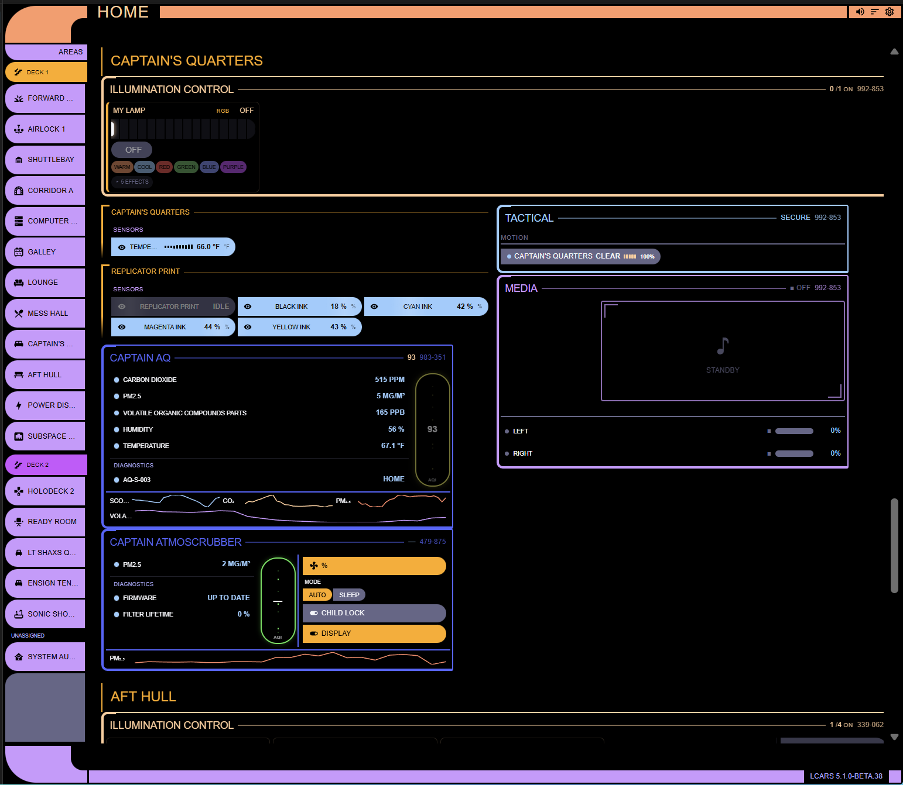
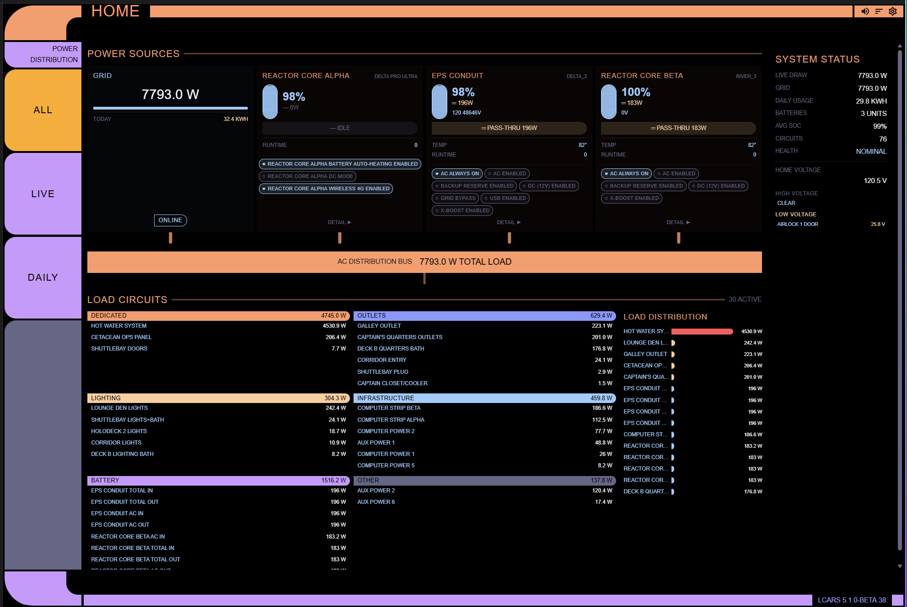
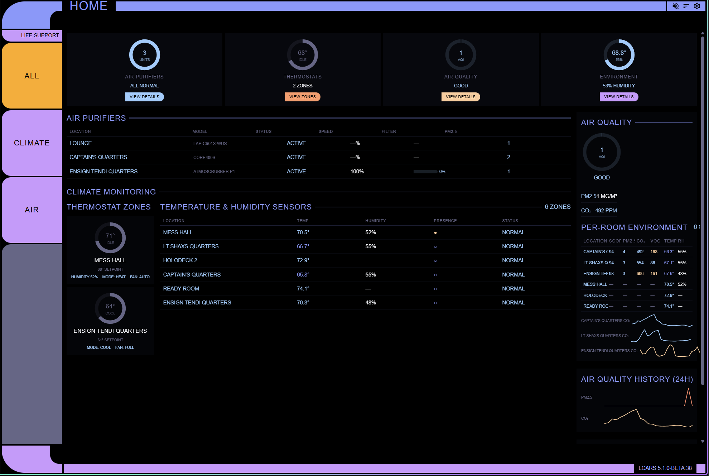
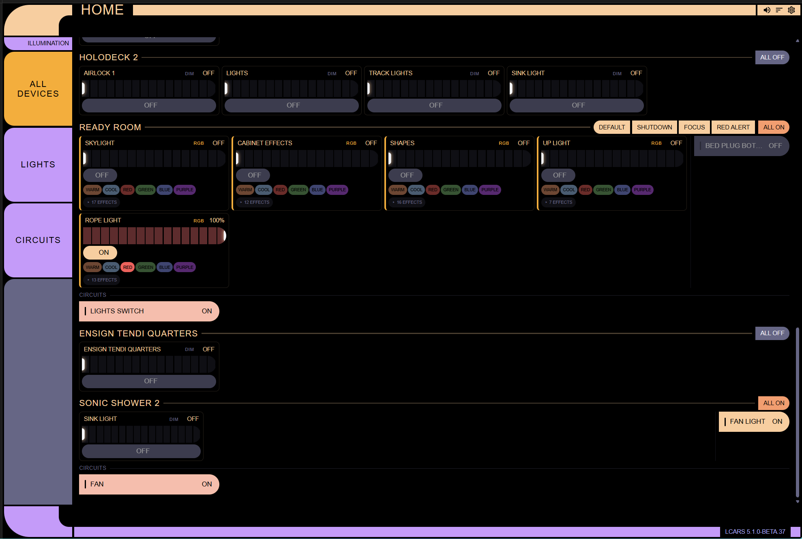
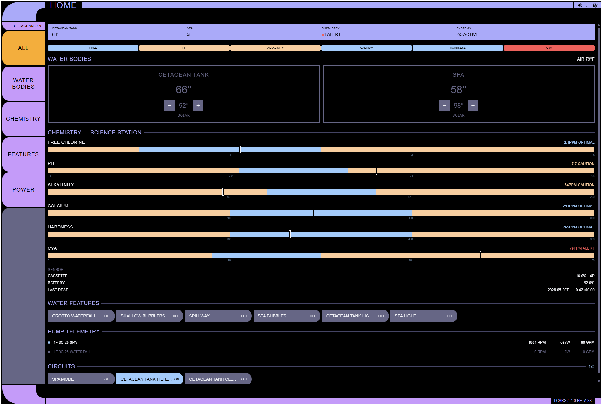
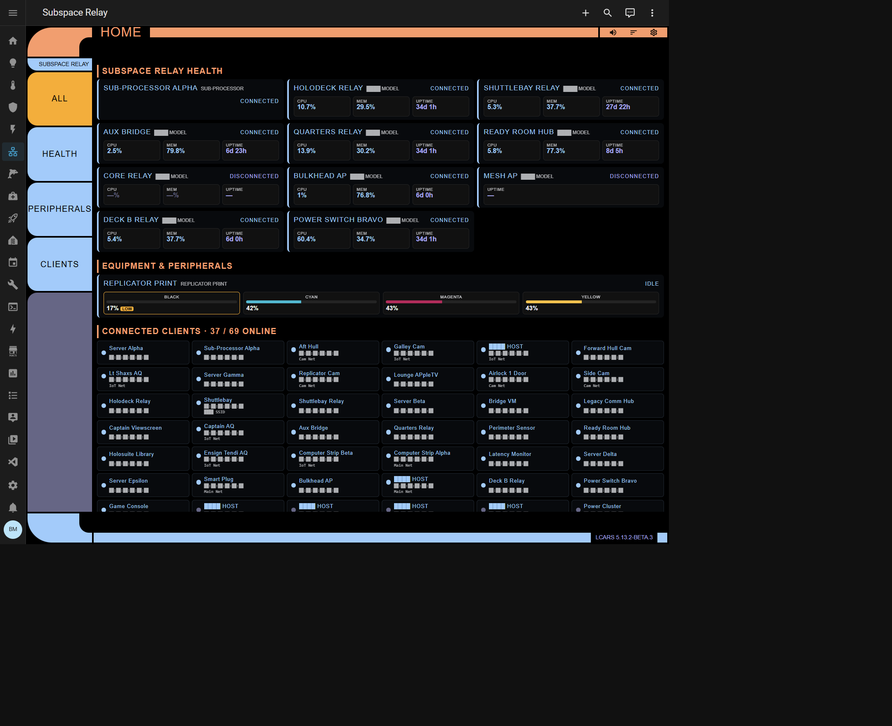
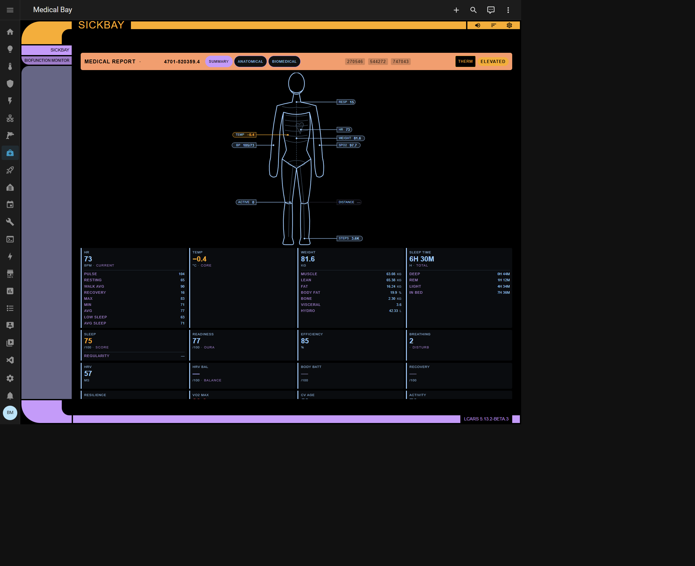
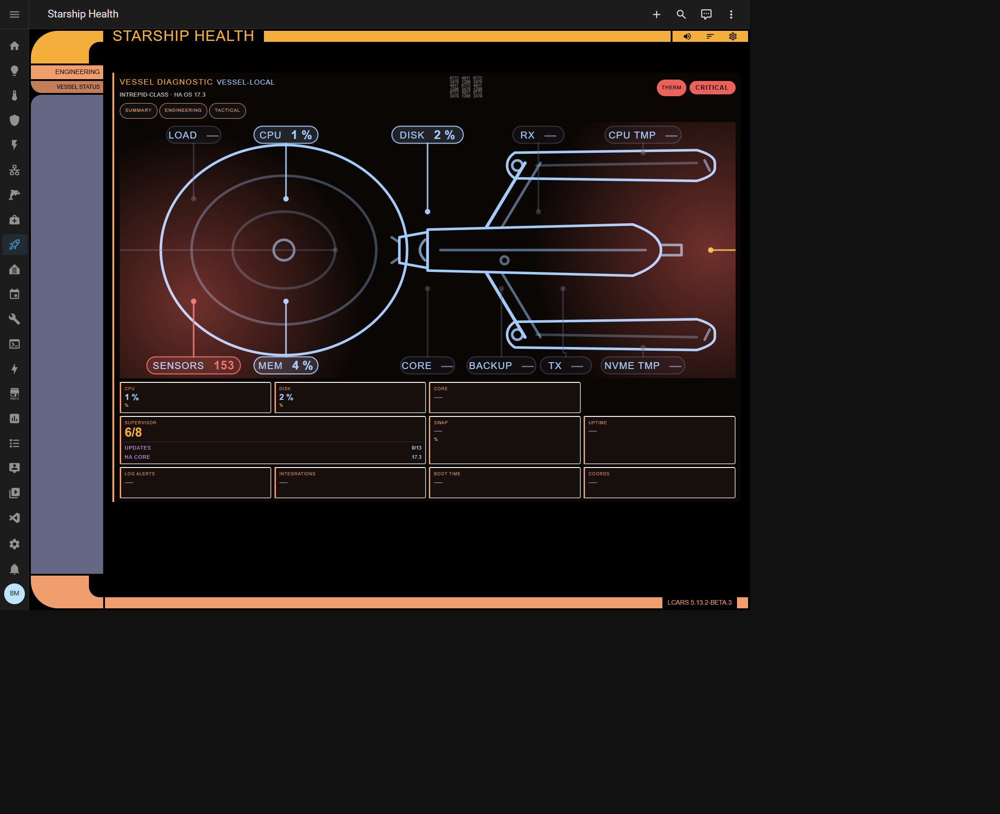

# LCARS Dashboard

<p align="center">
  
</p>

A Home Assistant custom dashboard with a full Star Trek LCARS (Library Computer Access/Retrieval System) interface. Nine dedicated dashboards — Habitat, Tactical, Engineering, Life Support, Illumination, Cetacean Ops, Subspace Relay (Network), Medical Bay, and Starship Health — each with their own layout, entity classifier, and sidebar filter controls.

[](https://github.com/hacs/integration)


[](https://github.com/htiel/LCARS-lovelace-dashboard/issues)

---

## Multi-Dashboard Architecture (5.0)

Version 5.0 replaces the single monolithic dashboard with a **multi-dashboard system**. Each dashboard is a self-contained Lovelace panel with its own YAML template, entity classifier, layout component, and sidebar filter controls. Users subscribe to the dashboards they want via the integration options flow — no YAML editing required.

### Available Dashboards

Each dashboard has its own full documentation in [`dashboards/`](dashboards/) — click the dashboard name to open it.

| Dashboard | Sidebar Title | Frame Color | Sidebar Filters | What It Shows |
|-----------|--------------|-------------|-----------------|---------------|
| **[Habitat](dashboards/HABITAT.md)** | Habitat | butterscotch | Area navigation | Room-by-room device control — the main dashboard. Floor-grouped sidebar, auto-detected panels per area |
| **[Tactical](dashboards/TACTICAL.md)** | Tactical | ice | ALL / ACCESS / ZONES | Security overview — alarm control, camera grid, door/window sensors, motion detectors, smoke/CO |
| **[Engineering](dashboards/ENGINEERING.md)** | Power Distribution | butterscotch | ALL / STORAGE / CIRCUITS | Power topology — grid/UPS/battery source cards → distribution bus → load circuit grid |
| **[Life Support](dashboards/LIFE-SUPPORT.md)** | Life Support | bluey | ALL / CLIMATE / AIR | Environmental monitoring — thermostats, air purifiers, per-room AQ tables, CO₂ sparklines, ring gauges |
| **[Illumination](dashboards/ILLUMINATION.md)** | Illumination | sunflower | ALL / LIGHTS / CIRCUITS | Lighting control — brightness bars, color presets, effects, scenes, and lighting circuit toggles |
| **[Cetacean Ops](dashboards/CETACEAN-OPS.md)** | Cetacean Ops | sky | ALL / WATER / CHEMISTRY / FEATURES / POWER | Pool & spa operations — water bodies, chemistry gauges, pump telemetry, equipment circuits |
| **[Subspace Relay](dashboards/SUBSPACE-RELAY.md)** | Subspace Relay | butterscotch + ice | ALL / NETWORK / EQUIPMENT / WAN / CLIENTS | Network health — UniFi infrastructure, WAN reachability, peripherals, connected clients (privacy-redacted by default with 60s reveal toggle) |
| **[Sickbay](dashboards/SICKBAY.md)** | Sickbay | gold + african-violet | SUMMARY / ANATOMICAL / BIOMEDICAL | Biofunction monitor — focus-mode tabs: SUMMARY (6-tile + silhouette + LAST SYNC row), ANATOMICAL (anterior silhouette + body-composition tile strip), BIOMEDICAL (HR / HRV / BP / SpO₂ / temp Δ + Stories 5–6 primitives: ECG waveform with LTTB-downsampled samples, BP 30-day range chart, HR-zones bars, GPS workout-route polyline, hypnogram, sleep-score breakdown). Admin-gated, default-disabled, per-profile consent gate + second-layer ECG consent. Wired to HealthyApps MQTT bridge, legacy `hae.*` entities, AND the [Health Auto Import](https://github.com/htiel/health-auto-import) v1.1.0 HACS integration. See [MQTT Sensor Setup](dashboards/SICKBAY.md#mqtt-sensor-setup) |
| **[Starship Health](dashboards/STARSHIP-HEALTH.md)** | Starship Health | gold + butterscotch | SUMMARY / ENGINEERING / TACTICAL | Vessel diagnostic — CPU / mem / temp / disk / WAN / addons rolled up onto a top-down landscape starship silhouette. Admin-gated. Multi-host: every Glances config entry adds a new vessel |

Only **Habitat** is enabled by default. Enable additional dashboards through the integration options flow ([see below](#dashboard-subscription-config-flow)).

#### Panel Gallery

> **[View the interactive panel gallery →](https://htmlpreview.github.io/?https://github.com/htiel/LCARS-lovelace-dashboard/blob/4.0/examples/lcars-panel-gallery.html)**
> Or open `examples/lcars-panel-gallery.html` locally to see static mockups of every panel type with sample data.

<table>
<tr>
<td width="33%" align="center">
<a href="examples/screenshots/habitat.png"></a><br><strong>Habitat</strong>
</td>
<td width="33%" align="center">
<a href="examples/screenshots/tactical.png"></a><br><strong>Tactical</strong>
</td>
<td width="33%" align="center">
<a href="examples/screenshots/power.png"></a><br><strong>Engineering</strong>
</td>
</tr>
<tr>
<td align="center">
<a href="examples/screenshots/life-support.png"></a><br><strong>Life Support</strong>
</td>
<td align="center">
<a href="examples/screenshots/illumination.png"></a><br><strong>Illumination</strong>
</td>
<td align="center">
<a href="examples/screenshots/cetacean-ops.png"></a><br><strong>Cetacean Ops</strong>
</td>
</tr>
<tr>
<td align="center">
<a href="examples/screenshots/subspace-relay.png"></a><br><strong>Subspace Relay</strong>
</td>
<td align="center">
<a href="examples/screenshots/sickbay.png"></a><br><strong>Sickbay</strong>
</td>
<td align="center">
<a href="examples/screenshots/starship-health.png"></a><br><strong>Starship Health</strong>
</td>
</tr>
</table>

> Screenshots use Star Trek: Lower Decks character/place names to obfuscate real device, area, and person names from the live deployments.

### Dashboard Subscription (Config Flow)

Dashboard selection is managed entirely through the Home Assistant UI — no YAML editing needed.

#### First Install
1. **Settings** → **Devices & Services** → **Add Integration** → **LCARS Dashboard**
2. The integration installs with Habitat enabled by default

#### Enabling / Disabling Dashboards
1. **Settings** → **Devices & Services** → **LCARS Dashboard** → **Configure**
2. **Step 1 — Dashboard Selection**: Check/uncheck dashboards to enable or disable them. At least one must remain enabled.
3. **Step 2 — Dashboard Configuration**: Set a custom sidebar title and icon for each enabled dashboard. Defaults are shown in the table above.
4. Click **Submit** — dashboards appear in (or are removed from) the HA sidebar immediately. No restart required.

#### Customizing Sidebar Titles & Icons

Each dashboard can have a custom name and MDI icon in the HA sidebar. For example, you could rename "Tactical" to "Security" or change "Life Support" to "Environment." Icon format is `mdi:icon-name` (e.g., `mdi:shield-home`, `mdi:leaf`).

### Dashboard Sidebar Reorder

LCARS dashboards can be reordered within the HA sidebar so they appear grouped together in your preferred order.

1. Open any LCARS dashboard
2. Click the **gear icon** (⚙) in the header endcap to enter edit mode
3. Select **Sidebar Order** to open the reorder editor
4. Drag dashboards up/down or use the move buttons to set your preferred order
5. Click **Apply** — the order is saved per-user and persists across sessions

The order is stored in the integration config entry and applied client-side. Non-LCARS sidebar items are unaffected.

### HA Labels for Entity Classification

LCARS auto-classifies entities using name-based heuristics, but you can override any classification using [Home Assistant Labels](https://www.home-assistant.io/docs/organizing/labels/) (2024.4+). Labels can be applied to entities, devices, or areas — LCARS checks all three levels.

Currently supported:
- **Camera location** (Tactical) — `exterior`/`interior` labels for camera filter
- **Circuit classification** (Engineering) — `dedicated`/`infrastructure`/`lighting`/`outlets`/`battery` labels for load circuit grouping

**For full tagging instructions, examples, and keyword fallback tables, see [TAGGING.md](TAGGING.md).**

---

## Features

### Layout & Navigation
- **LCARS Frame** — Authentic elbows, header/footer bars, endcaps, and sidebar in the classic Okudagram style
- **Floor-Grouped Sidebar** — Areas grouped by HA floor with clickable floor headers (lilac); click a floor for combined view, click an area to drill down
- **Smart Name Shortening** — Automatically strips area and device name prefixes from entity names for cleaner display
- **Device-Grouped Layout** — Entities organized by device, then sorted by domain (cameras first, sensors last)
- **Responsive (Geordi-canon, beta.37+)** — On phone widths (≤ 767 px) the LCARS swept silhouette is preserved (PADD canon — never flipped to a horizontal bar). The frame narrows to one elbow unit (~88 px), and on Habitat the area buttons collapse to **icon-only** (the area's `mdi:` icon, with `aria-label` + `title=` for screen readers and long-press)
- **Panel Reorder** — Edit mode gear pip on each panel for persistent reorder within an area (saved via WebSocket to YAML)
- **Deep Linking** — URL hash navigation (`#area:<area_id>`) for bookmarking and cross-dashboard links

### Auto-Detected Panels (Habitat)

The Habitat dashboard auto-discovers devices and routes them to the correct panel using a priority-ordered classifier: camera → alarm → pool/spa → climate → media → environment → irrigation → weather → ev charger → power → battery. Area-level composite panels (life support, illumination) aggregate entities across devices.

The 12 auto-detected panel types (Camera, Climate, Alarm, Media, Pool & Spa, Weather, Irrigation, Environment / Atmoscrubber, Power Systems, Warp Core Battery, EV Charger, Life Support per-area) are documented in detail in **[dashboards/HABITAT.md](dashboards/HABITAT.md)**, along with their integration coverage and routing rules.

---

### Domain-Specific Renderers (Habitat)

Entities not routed to a panel render with domain-specific controls:

| Domain | Renderer |
|--------|----------|
| `camera` | LCARS-framed live feed with viewscreen activation |
| `light` | Toggle pill with brightness slider, color temp |
| `switch` / `input_boolean` | Toggle pill with heartbeat pulse |
| `fan` | Toggle pill with speed percentage |
| `lock` | Lock/unlock toggle with confirmation |
| `cover` | Open/close/stop with position control |
| `sensor` / `binary_sensor` | Data readout bars with segmented fill |
| `climate` | Routed to Climate Panel |
| `alarm_control_panel` | Routed to Alarm Panel |
| `media_player` | Routed to Media Panel |

### Internal Sensors Grid

Standalone `lcars-internal-sensors-grid` card for temperature/humidity monitoring. Auto-discovers SwitchBot meters and similar sensor-only devices, groups by floor, responsive tile grid with comfort-class colors, SVG sparklines, battery badges, and ship-wide averages.

### Visual Design
- **6 LCARS Animations** — Cascade reveal, scan sweep, viewscreen activation, heartbeat pulse, distress pulse, segmented sensor bars
- **Dynamic Panel Visuals** — Frame breathing pulse, data pip footers, numeric code watermarks, audio waveform, caustic water shimmer, wind compass, weather glow, barberpole flow, particle system, comfort glow tiles
- **Dashboard Animations** — Scanning section headers, thermostat breathing glow, distribution bus pulse, conduit flow, circuit/filter bar shimmer, AQ hero pulse, ring gauge glow, table row highlights
- **GPU-Composited** — All animations use `transform`/`opacity` for 60fps rendering
- **`prefers-reduced-motion`** — Comprehensive overrides: ambient loops disabled, confirmations halved, static fallbacks

### Audio System
- **15 synthesized sounds** via Web Audio API (OscillatorNode → GainNode) — no external audio files
- **All 14 panel types wired** — contextual feedback for toggles, adjustments, alerts, navigation, and state transitions
- **Mute toggle** in header endcap, persisted to localStorage
- **Accessibility** — Respects `prefers-reduced-motion`, soft volumes (0.10–0.15 gain)

### Security & Accessibility
- **Alarm PIN** — Rate-limited (3 attempts/60s), never logged or in DOM attributes, digit-only sanitization
- **Media artwork** — URL validation restricts to `/api/` or `/local/` paths
- **Setpoint clamping** — Temperature controls validated against entity min/max with absolute bounds
- **Service call throttling** — Token-bucket rate limiter on all device control calls
- **YAML concurrency** — All read-modify-write WebSocket handlers protected by per-file `asyncio.Lock`
- **Static asset isolation** — Only compiled bundle served via HTTP (`js/dist/`); source files, `package.json`, and webpack config not exposed
- **!include path boundary** — YAML `!include` directives validated against HA config directory via `os.path.realpath()` — blocks traversal and symlink escape
- **Blueprint depth cap** — Blueprint YAML limited to 256 KB and 20 levels of nesting to prevent resource exhaustion
- **Sidebar order validation** — Dashboard order validated against allowlist; no private HA API usage
- **Skip-nav link** — Hidden link jumps to `<main>` on first Tab press
- **ARIA landmarks** — Full keyboard navigation, `role` structure, `aria-live` announcements
- **WCAG 2.2 AA** — Color-blind safe indicators, `focus-visible` outlines (ice), 24×24px minimum targets, summary bar contrast ≥4.5:1
- **Self-contained** — All fonts (Antonio) and dependencies vendored locally, no external CDN calls

<table>
<tr>
<td width="50%" align="center">

<a href="examples/screenshots/habitat.png"></a>

**Habitat** — Room-by-room device control with floor-grouped sidebar, auto-detected panels, and area deep linking.

</td>
<td width="50%" align="center">

<a href="examples/screenshots/tactical.png"></a>

**Tactical** — Security dashboard with camera grid, alarm control, door/window sensors, motion dots, and hazard alerts.

</td>
</tr>
<tr>
<td align="center">

<a href="examples/screenshots/power.png"></a>

**Engineering** — Power distribution topology: grid/UPS/battery sources → animated distribution bus → load circuit grid.

</td>
<td align="center">

<a href="examples/screenshots/life-support.png"></a>

**Life Support** — Environmental monitoring with ring gauge overview cards, per-room AQ table, CO₂ sparklines, and climate zones.

</td>
</tr>
<tr>
<td align="center">

<a href="examples/screenshots/illumination.png"></a>

**Illumination** — Full-width lighting control with brightness bars, color presets, effect strips, scenes, and circuit toggles.

</td>
<td align="center">

<a href="examples/screenshots/cetacean-ops.png"></a>

**Cetacean Ops** — Pool & spa operations with water body viewscreens, chemistry gauges, pump telemetry, and equipment circuits.

</td>
</tr>
</table>

## Installation (HACS)

### Stable (4.x)

1. Open HACS in Home Assistant
2. Go to **Integrations** → **Custom repositories**
3. Add `https://github.com/htiel/LCARS-lovelace-dashboard` as an **Integration**
4. Install **LCARS Dashboard**
5. Restart Home Assistant
6. Go to **Settings** → **Devices & Services** → **Add Integration** → **LCARS Dashboard**
7. Habitat dashboard appears in the sidebar — open it to verify

### Beta (5.x — Multi-Dashboard)

The 5.x beta includes the multi-dashboard architecture, dedicated dashboards (Tactical, Engineering, Life Support, Illumination, Cetacean Ops), config flow picker, and sidebar reorder.

1. Install LCARS Dashboard via HACS using the stable steps above (if not already installed)
2. In HACS, find **LCARS Dashboard** in your installed integrations
3. Click the **⋮** (three-dot menu) → **Redownload**
4. Toggle **Show beta versions** ON
5. Select the latest `5.x.x-beta.x` version from the dropdown
6. Click **Download**
7. Restart Home Assistant

To return to stable, repeat steps 2–6 but toggle **Show beta versions** OFF and select the latest `4.x.x` version.

### Enabling Additional Dashboards

After installation, additional dashboards are enabled through the integration options flow. See **[Dashboard Subscription (Config Flow)](#dashboard-subscription-config-flow)** above for the step-by-step.

### Upgrading from 4.x

If you're upgrading from LCARS Dashboard 4.x:

- The single "LCARS Dashboard" panel is automatically migrated to the new **Habitat** dashboard
- Your existing sidebar title and icon are preserved and mapped to the Habitat entry
- The URL path changes from `lcars-dashboard` to `lcars-habitat` — update any bookmarks
- All 5.0 features (multi-dashboard, config flow picker, sidebar reorder) become available
- No manual YAML migration is needed — the integration handles it on first load

## Architecture

| Layer | Technology |
|-------|-----------|
| HA Integration | Python custom component (`lcars_dashboard`) — config flow, WebSocket API, YAML processing |
| Dashboards | 6 independent Lovelace YAML panels, each with dedicated layout component and entity classifier |
| Frontend | Lit Element v2 web components — 12 extracted panel elements + 6 layout components + shared base class |
| Build | Webpack 5 → single `lcars-dashboard.js` bundle (~951 KiB), output to `js/dist/` |
| Styling | 3-tier CSS composition: base variables → component shadow DOM → panel-specific modules |
| Components | 7 shared components: `<lcars-panel-frame>`, `<lcars-sensor-row>`, `<lcars-section-divider>`, `<lcars-option-strip>`, `<lcars-setpoint>`, `<lcars-segmented-bar>`, `<lcars-summary-badge>` |
| Communication | WebSocket API (35+ commands) + window custom events |
| Config | Two-step options flow: dashboard selection → per-dashboard title/icon customization |

### Dashboard Registration Flow

```
config_flow.py                    const.py                        load_dashboard.py
┌──────────────┐                 ┌──────────────────┐            ┌─────────────────────┐
│ Options Flow │──── saves ────→ │ DASHBOARD_REGISTRY│──── maps → │ _register_single_   │
│ Step 1: Pick │                 │ 6 dashboard defs  │            │  dashboard()         │
│ Step 2: Name │                 └──────────────────┘            │                     │
└──────────────┘                                                  │ → LovelaceYAML panel│
        ↓                                                         │ → Sidebar entry     │
  entry.options                                                   └─────────────────────┘
  {dashboards: [...],                                                      ↓
   habitat_title: "...",                                          ui-lovelace-{key}.yaml
   security_icon: "..."}                                          + layout component
```

## Changelog

See [CHANGELOG.md](CHANGELOG.md) for the full version history.

## Issues & Feature Requests

Found a bug or have an idea? File it on GitHub:

- [**Report a Bug**](https://github.com/htiel/LCARS-lovelace-dashboard/issues/new?template=bug_report.yml) — something broken or unexpected
- [**Request a Feature**](https://github.com/htiel/LCARS-lovelace-dashboard/issues/new?template=feature_request.yml) — suggest a new capability or enhancement
- [**Browse Open Issues**](https://github.com/htiel/LCARS-lovelace-dashboard/issues) — see what's already reported

When reporting a bug, please include your LCARS Dashboard version, HA version, and steps to reproduce.

## Attribution

This project is a fork of [Dwains Dashboard](https://github.com/dwainscheeren/dwains-lovelace-dashboard) by **Dwain Scheeren** ([@dwainscheeren](https://github.com/dwainscheeren)).

The original Dwains Dashboard provided the Home Assistant integration architecture, auto-generating dashboard engine, websocket API, and Lovelace panel registration. The LCARS visual redesign, new Lit web components, and self-contained dependency bundling are by [@htiel](https://github.com/htiel).

### LCARS Design Attribution

LCARS (Library Computer Access/Retrieval System) is the fictional computer interface from Star Trek, designed by scenic art supervisor **Michael Okuda**. The visual language — elbows, pill buttons, flat colors, uppercase typography — is commonly known as the "Okudagram" style.

> STAR TREK and related marks are trademarks of CBS Studios Inc. This project is a fan work and is not affiliated with or endorsed by CBS Studios Inc. or Paramount Global.

The LCARS visual design in this project draws from the following community references:

| Resource | Author | Contribution |
|----------|--------|-------------|
| [TheLCARS.com](https://www.thelcars.com/) | Jim Robertus | Canonical LCARS web template — color palette, typography rules, layout structure |
| [LCARS CSS Framework](https://github.com/joernweissenborn/lcars) | Jörn Weißenborn | Grid system mathematics — base unit (7.5rem), vertical unit (3rem), 0.25rem gap, elbow proportions |
| [Bracer Jack's LCARS Guidelines](http://www.lcars-terminal.de/tutorial/guideline.htm) | Bracer Jack | Design theory & manifesto — thick↔thin rule, color count limits, the "swept is LCARS" philosophy |
| [System 47](https://www.mewho.com/system47/) | Mewho | Animation timing reference — scrolling data, panel refresh rhythms, audio grammar |
| [Ex Astris Scientia](https://www.ex-astris-scientia.org/inconsistencies/lcars.htm) | Bernd Schneider | Screen-accurate LCARS analysis across all Trek series — canonical color evolution, layout patterns |
| [lcars R Package](https://leonawicz.github.io/lcars/) | Matthew Leonawicz | Era-specific color palettes (2357/TNG, 2369/DS9, 2375/Voyager, 2379/Nemesis) |

LCARS Inspired Website Template by [www.TheLCARS.com](https://www.thelcars.com/), with modifications.

### Third-party components included

| Component | Author | License | Source |
|-----------|--------|---------|--------|
| card-tools | Thomas Loven | MIT | [lovelace-card-tools](https://github.com/thomasloven/lovelace-card-tools) |
| custom-card-helpers | Bram Kragten | Apache-2.0 | [custom-card-helpers](https://github.com/custom-cards/custom-card-helpers) |
| Antonio font | Vernon Adams | OFL-1.1 | [Google Fonts](https://fonts.google.com/specimen/Antonio) |
| lit-element / lit-html | Google | BSD-3-Clause | [Lit](https://lit.dev) |
| sortablejs | RubaXa | MIT | [SortableJS](https://github.com/SortableJS/Sortable) |
| js-cookie | js-cookie | MIT | [js-cookie](https://github.com/js-cookie/js-cookie) |
| @mdi/js | Pictogrammers | Apache-2.0 | [MDI](https://materialdesignicons.com) |

## License

MIT - see [LICENSE.md](LICENSE.md)