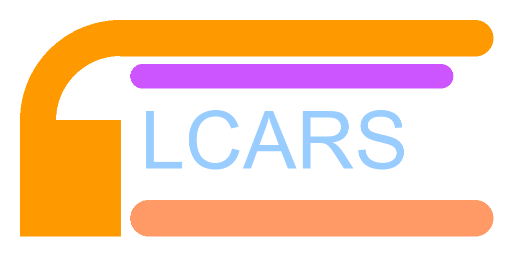

# LCARS Dashboard

  

A Home Assistant custom dashboard with a full Star Trek LCARS (Library Computer Access/Retrieval System) interface.

## Features

- **LCARS Frame Layout** — Authentic elbows, header/footer bars, endcaps, and sidebar in the classic Okudagram style
- **Floor-Grouped Area Navigation** — Areas grouped by HA floor in the sidebar with clickable floor headers (lilac); click a floor for combined view, click an area to drill down
- **Domain-Specific Entity Renderers**
  - Camera → LCARS-framed live feed with viewscreen activation animation
  - Light / Switch / Fan / Lock → Toggle pills with heartbeat pulse
  - Sensor / Binary Sensor → Data readout bars with segmented fill
  - Climate → Thermostat panel | Cover → Position controls | Media Player → Media strip
- **Warp Core Battery Panel** — Auto-detects battery devices (EcoFlow, etc.), renders CSS reactor core with charge-level color, SOC gauge, power flow I/O arrows, telemetry sensors, and integrated config/diagnostic entity controls with LCARS option strips
- **Atmoscrubber Environment Panel** — Auto-detects air quality devices (Awair, VeSync purifiers, etc.), renders animated particle cylinder with AQI-mapped colors, 24h SVG sparklines, fan/preset controls, and sensor-only mode for monitor-only devices
- **Smart Name Shortening** — Automatically strips area and device name prefixes from entity names for cleaner display
- **Device-Grouped Layout** — Entities organized by device, then sorted by domain (cameras first, sensors last)
- **6 LCARS Animations** — Cascade reveal, scan sweep, viewscreen activation, heartbeat pulse, distress pulse, segmented sensor bars
- **Self-Contained** — All fonts (Antonio) and dependencies vendored locally, no external CDN calls
- **Responsive** — Mobile-friendly layout with horizontal area scroll on narrow viewports
- **Accessible** — ARIA landmarks, keyboard navigation, `prefers-reduced-motion` support

## Screenshots

*Coming soon*

## Installation (HACS)

1. Open HACS in Home Assistant
2. Go to **Integrations** → **Custom repositories**
3. Add `https://github.com/htiel/LCARS-lovelace-dashboard` as an **Integration**
4. Install **LCARS Dashboard**
5. Restart Home Assistant
6. Go to **Settings** → **Devices & Services** → **Add Integration** → **LCARS Dashboard**

## Architecture

| Layer | Technology |
|-------|-----------|
| HA Integration | Python custom component (`lcars_dashboard`) |
| Frontend | Lit Element v2 web components |
| Build | Webpack 5 → single `lcars-dashboard.js` bundle (~200 KiB) |
| Styling | 40+ LCARS CSS custom properties in shared `lcars-styles.js` |
| Communication | WebSocket API + window custom events |

## Changelog

See [CHANGELOG.md](CHANGELOG.md) for the full version history.

## Attribution

This project is a fork of [Dwains Dashboard](https://github.com/dwainscheeren/dwains-lovelace-dashboard) by **Dwain Scheeren** ([@dwainscheeren](https://github.com/dwainscheeren)).

The original Dwains Dashboard provided the Home Assistant integration architecture, auto-generating dashboard engine, websocket API, and Lovelace panel registration. The LCARS visual redesign, new Lit web components, and self-contained dependency bundling are by [@htiel](https://github.com/htiel).

### Third-party components included

| Component | Author | License | Source |
|-----------|--------|---------|--------|
| card-tools | Thomas Loven | MIT | [lovelace-card-tools](https://github.com/thomasloven/lovelace-card-tools) |
| custom-card-helpers | Bram Kragten | Apache-2.0 | [custom-card-helpers](https://github.com/custom-cards/custom-card-helpers) |
| Antonio font | Vernon Adams | OFL-1.1 | [Google Fonts](https://fonts.google.com/specimen/Antonio) |
| lit-element / lit-html | Google | BSD-3-Clause | [Lit](https://lit.dev) |
| sortablejs | RubaXa | MIT | [SortableJS](https://github.com/SortableJS/Sortable) |
| @mdi/js | Pictogrammers | Apache-2.0 | [MDI](https://materialdesignicons.com) |

## License

MIT - see [LICENSE.md](LICENSE.md)