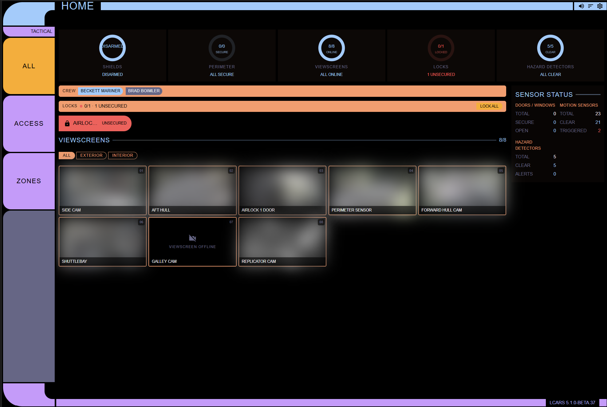

# Tactical Dashboard

> Single pane of glass for security. Camera grid, alarm control, door/window sensors, motion detectors, smoke/CO.

[← Back to README](../README.md) · [Spec: LCARS-TACTICAL-DASHBOARD-SPEC.md](../specs/LCARS-TACTICAL-DASHBOARD-SPEC.md)

  

## Sidebar Metadata

| Field | Value |
|-------|-------|
| Default sidebar title | **Tactical** |
| Frame color | ice |
| Sidebar filters | ALL / ACCESS / ZONES |
| Enabled by default | No (enable via integration options) |

## What It Shows

Security overview with a 2×3 camera viewscreen grid (LCARS corner brackets), alarm control shield viewscreen, door/window sensor pills (SEALED / BREACH), motion indicator dots, and smoke/gas/safety sensors. The summary bar shows shield status, perimeter integrity, and active camera count. Camera badges highlight with red alert for pending/triggered alarm states.

## Entity Scope

- `alarm_control_panel`
- `lock`
- `camera`
- `binary_sensor` (door, window, motion, occupancy, smoke, safety, glass break)

## Integrations

- **Alarm**: SimpliSafe, Honeywell Home, Ring, Alarmo
- **Cameras**: UniFi Protect, Amcrest, ONVIF, Reolink
- **Sensors**: Insteon, Z-Wave, Zigbee2MQTT, Nest Protect

## Tagging

Camera location is auto-detected by name heuristic but can be explicitly overridden with Home Assistant Labels (`exterior` / `interior`). See [TAGGING.md](../TAGGING.md) for the keyword fallback table and label setup.

## Filters

| Filter | Shows |
|--------|-------|
| ALL | Every tactical entity |
| ACCESS | Doors, windows, locks |
| ZONES | Motion, occupancy, glass break, smoke, safety |

## Related Specs

- [LCARS-ALARM-PANEL-SPEC.md](../specs/LCARS-ALARM-PANEL-SPEC.md)
- [LCARS-CAMERA-PANEL-SPEC.md](../specs/LCARS-CAMERA-PANEL-SPEC.md)
- [LCARS-CAMERA-TOKEN-MIGRATION-SPEC.md](../specs/LCARS-CAMERA-TOKEN-MIGRATION-SPEC.md)
- [LCARS-HAZARD-PANEL-SPEC.md](../specs/LCARS-HAZARD-PANEL-SPEC.md)
- [LCARS-TACTICAL-REDESIGN-VISION.md](../specs/LCARS-TACTICAL-REDESIGN-VISION.md)
- [LCARS-TACTICAL-CHRONICLE-MODE-SPEC.md](../specs/LCARS-TACTICAL-CHRONICLE-MODE-SPEC.md)
